# 🎯 SAM 2++: Tracking Anything at Any Granularity

<p align="center">
  <a href="https://tracking-any-granularity.github.io/"></a>
  <a href="https://arxiv.org/abs/2510.18822"></a>
  <a href="https://huggingface.co/MCG-NJU/SAM2-Plus"></a>
  <a href="https://huggingface.co/datasets/MCG-NJU/Tracking-Any-Granularity"></a>
  <a href="TODO"></a>
</p>

[Jiaming Zhang](https://scholar.google.com/citations?hl=en&user=0lLB3fsAAAAJ), Cheng Liang, Yichun Yang, Chenkai Zeng,<br> [Yutao Cui](https://scholar.google.com/citations?user=TSMchWcAAAAJ&hl=en&oi=ao), Xinwen Zhang, Xin Zhou, Kai Ma, Gangshan Wu, [Limin Wang](http://wanglimin.github.io/)

**[Multimedia Computing Group, Nanjing University](http://mcg.nju.edu.cn/)**

## 🌟 Overview


Existing trackers are often task-specific, limiting generalization.
We present a unified tracker, **SAM 2++**, unifies tracking across masks, boxes, and points through task-specific prompts, a unified decoder, and a task-adaptive memory mechanism.
Trained with the large-scale **Tracking-Any-Granularity** dataset, which extend with data engine, SAM 2++ achieves state-of-the-art performance across diverse benchmarks, offering a robust unified tracking framework.

## 🏗️ SAM 2++ Model


- We present a unified video tracking framework, termed as **SAM 2 ++**, which extends the SAM 2 model to track any targets in videos at any granularity, including masks, bounding boxes, and points.
- Due to the various task granularities, we introduce **task-specific prompts** to unify task input in different granularities and the **Unified Decoder** to unify diverse task results into a unified form pre-output.
- During mixture training, we found that a fully parameter-shared model training results in performance degradation due to the diverse memory requirements across tasks. To address this, we introduce a **task-adaptive memory mechanism** that dynamically adjusts memory representations according to each task's demand, enhancing the multi-task processing capability.

## 🗃️ Tracking-Any-Granularity Dataset

- We developed a comprehensive dataset for training our unified model, termed **T**racking-**A**ny-**G**ranularity (TAG), with annotations across three granularities: *segmentation masks, bounding boxes, and key points*. You can find some sample video sequences from the TAG dataset below (better view more samples in [project page](https://tracking-any-granularity.github.io/)):

  <table  align="center">
    <tbody>
      <tr>
        <td>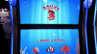</td>
        <td></td>
        <td>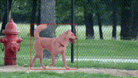</td>
      </tr>
    </tbody>
  </table>

  <table  align="center">
    <tbody>
      <tr>
        <td>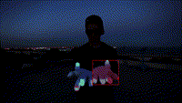</td>
        <td>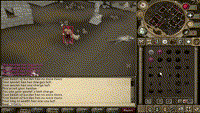</td>
        <td>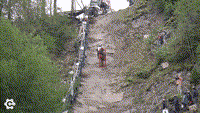</td>
      </tr>
    </tbody>
  </table>

  <table  align="center">
    <tbody>
      <tr>
        <td>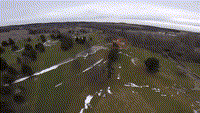</td>
        <td></td>
        <td></td>
      </tr>
    </tbody>
  </table>

- Our dataset includes **a wide range of video sources**, demonstrating **strong diversity** and serving as a solid benchmark for evaluating tracking performance. Each video sequence is annotated with **18 attributes** representing different tracking challenges, which can appear simultaneously in the same video. Common challenges include motion blur, deformation, and partial occlusion, reflecting the dataset’s high difficulty. Most videos contain multiple attributes, indicating the dataset’s coverage of complex and diverse tracking scenarios.


- The dataset has been released on [Hugging Face](https://huggingface.co/datasets/MCG-NJU/Tracking-Any-Granularity) and can be downloaded using the following code:

```bash
pip install huggingface_hub[cli]
huggingface-cli download MCG-NJU/Tracking-Any-Granularity --repo-type dataset --local-dir ../Tracking-Any-Granularity --local-dir-use-symlinks False --max-workers 16
```

## 🔥 Latest News

- **[2025-10-29]** Release [simple script](#-inference-sam-2) for each task.
- **[2025-10-29]** Release model checkpoint on [Hugging Face](https://huggingface.co/MCG-NJU/SAM2-Plus).
- **[2025-10-24]** [SAM 2++ model](https://github.com/MCG-NJU/SAM2-Plus) and part of [Tracking-Any-Granularity dataset](https://huggingface.co/datasets/MCG-NJU/tracking-any-granularity) are released. Check out the [project page](https://tracking-any-granularity.github.io/) for more details.

## 📑 Todo List

- [ ] Challenge Leaderboard for Tracking-Any-Granularity dataset
- [ ] Usage with 🤗 Transformers
- [x] Upload model to 🤗 Hugging Face Model Hub
- [ ] Notebook Demo

## 🛠️ Installation

- Clone the repo:

```bash
git clone https://github.com/MCG-NJU/SAM2-Plus.git
cd SAM2-Plus
```

- Install the required packages:

```bash
# The code requires `python>=3.10`, as well as `torch>=2.5.1` and `torchvision>=0.20.1`.

conda create -n sam2_plus python=3.10 -y
conda activate sam2_plus

export PYTHONPATH=$PYTHONPATH:$(pwd)

pip install torch==2.5.1 torchvision==0.20.1 torchaudio==2.5.1 --index-url https://download.pytorch.org/whl/cu121 # torch 2.5.1 with cuda 12.1 for example

pip install -r sam2_plus/requirements.txt
pip install -r sav_dataset/requirements.txt

pip install -e .

pip install -e ".[dev]"
#pip install -e ".[notebooks]"
#pip install -e ".[interactive-demo]"

python setup.py build_ext --inplace
python -c "import torch; print(torch.__version__); print(torch.cuda.is_available()); from sam2 import _C"
```

- Our project is developed based on SAM 2, so if you have any questions about installation, you can go to its [F&Q section](https://github.com/facebookresearch/sam2#installation) for answers. 
- Of course, you can also ask questions in our issue section, and we'll be happy to answer them.

## ▶️ Getting Started

### 📥 Download Checkpoints

First, we need to download checkpoint from [huggingface](https://huggingface.co/MCG-NJU/SAM2-Plus) with the script below to download all checkpoints:

```bash
pip install huggingface_hub[cli]
huggingface-cli download MCG-NJU/SAM2-Plus --local-dir ./checkpoints/SAM2-Plus --local-dir-use-symlinks False --max-workers 16
```

## 🪄 Inference SAM 2++

We provide an example script for running inference with SAM 2++ on our Tracking-Any-Granularity dataset. You can run the following command to test the model on a video sequence with different granularities:

**[Video Object Segmentation (Mask Granularity)](tools/vos_inference_plus.sh)**
```
import os
import torch
import matplotlib.pyplot as plt
from PIL import Image
from tqdm import tqdm
from natsort import natsorted

from sam2_plus.build_sam import build_sam2_video_predictor_plus

from tools.visualization import show_mask, show_box, show_points
from tools.vos_inference import load_ann_png, get_per_obj_mask, DAVIS_PALETTE, save_masks_to_dir

predictor = build_sam2_video_predictor_plus(
    config_file="configs/sam2.1/sam2.1_hiera_b+_predmasks_decoupled_MAME.yaml",
    ckpt_path="./checkpoints/SAM2-Plus/checkpoint_phase123.pt",
    apply_postprocessing=False,
    hydra_overrides_extra=[
        "++model.non_overlap_masks=" + ("false")
    ],
    vos_optimized=False,
    task='mask'
)

input_video_dir = "./examples/JPEGImages/horsejump-low"
input_mask_path = "./examples/Annotations/horsejump-low/00000.png"
output_mask_dir = "./output/Annotations/"

score_thresh = 0

with torch.inference_mode(), torch.autocast("cuda", dtype=torch.bfloat16):
    inference_state = predictor.init_state(video_path=input_video_dir)

    video_name = os.path.basename(input_video_dir)
    frame_names = [
        os.path.splitext(p)[0]
        for p in os.listdir(input_video_dir)
        if os.path.splitext(p)[-1] in [".jpg", ".jpeg", ".JPG", ".JPEG", ".png", ".PNG"]
    ]
    frame_names = natsorted(frame_names)
    height = inference_state["video_height"]
    width = inference_state["video_width"]

    input_frame_idx = 0     # the frame index we interact with
    object_id = 1           # give a unique id to each object we interact with (it can be any integers)

    input_palette = None
    input_mask, input_palette = load_ann_png(input_mask_path)
    per_obj_input_mask = get_per_obj_mask(input_mask)
    object_mask = per_obj_input_mask[object_id]

    predictor.add_new_mask(
        inference_state=inference_state,
        frame_idx=input_frame_idx,
        obj_id=object_id,
        mask=object_mask,
    )

    # run propagation throughout the video and collect the results in a dict
    os.makedirs(os.path.join(output_mask_dir, video_name), exist_ok=True)
    output_palette = input_palette or DAVIS_PALETTE
    video_segments = {}  # video_segments contains the per-frame segmentation results
    for out_frame_idx, out_obj_ids, out_mask_logits, _, _ in predictor.propagate_in_video(
        inference_state
    ):
        per_obj_output_mask = {
            out_obj_id: (out_mask_logits[i] > score_thresh).cpu().numpy()
            for i, out_obj_id in enumerate(out_obj_ids)
        }
        video_segments[out_frame_idx] = per_obj_output_mask
    
    # write the output masks as palette PNG files to output_mask_dir
    for out_frame_idx, per_obj_output_mask in video_segments.items():
        save_masks_to_dir(
            output_mask_dir=output_mask_dir,
            video_name=video_name,
            frame_name=frame_names[out_frame_idx],
            per_obj_output_mask=per_obj_output_mask,
            height=height,
            width=width,
            per_obj_png_file=False,
            output_palette=output_palette,
        )
    
    # visualize the tracking results
    for out_frame_idx in tqdm(range(0, len(frame_names)), desc="Visualization Results"):
        plt.clf()
        plt.figure()
        # plt.title(f"frame {out_frame_idx}")
        plt.imshow(Image.open(os.path.join(input_video_dir, frame_names[out_frame_idx] + ".jpg")))
        for out_obj_id, out_mask in video_segments[out_frame_idx].items():
            show_mask(out_mask, plt.gca(), obj_id=out_obj_id)
        plt.axis('off')
        plt.subplots_adjust(left=0, right=1, top=1, bottom=0)
        plt.savefig(f"{output_mask_dir}/{video_name}/{out_frame_idx:05d}_withMask.png", dpi=300, bbox_inches='tight', pad_inches=0)
        plt.close()
```

**[Video Object Tracking (Box Granularity)](tools/sot_inference_plus.sh)**
```
import os
import torch
import matplotlib.pyplot as plt
from PIL import Image
from tqdm import tqdm
from natsort import natsorted
import numpy as np
import logging

from sam2_plus.build_sam import build_sam2_video_predictor_plus

from tools.visualization import show_mask, show_box, show_points
from tools.vos_inference import load_ann_png, get_per_obj_mask, DAVIS_PALETTE, save_masks_to_dir
from tools.sot_inference import save_boxes_to_dir, save_masks_and_boxes_to_dir
from training.dataset_plus.box.utils import np_box_xywh_to_xyxy, np_box_xyxy_to_xywh, np_masks_to_boxes, np_box_clamp_xywh
from benchmarks.sot_benchmark.datasets.utils import load_text

predictor = build_sam2_video_predictor_plus(
    config_file="configs/sam2.1/sam2.1_hiera_b+_predmasks_decoupled_MAME.yaml",
    ckpt_path="./checkpoints/SAM2-Plus/checkpoint_phase123.pt",
    apply_postprocessing=False,
    hydra_overrides_extra=[
        "++model.non_overlap_masks=" + ("false")
    ],
    vos_optimized=False,
    task='box'
)

input_video_dir = "./examples/JPEGImages/horsejump-low"
input_box_path = "./examples/Boxes/horsejump-low.txt"
output_box_dir = "./output/Boxes/"

score_thresh = 0

with torch.inference_mode(), torch.autocast("cuda", dtype=torch.bfloat16):
    inference_state = predictor.init_state(video_path=input_video_dir)

    video_name = os.path.basename(input_video_dir)
    frame_names = [
        os.path.splitext(p)[0]
        for p in os.listdir(input_video_dir)
        if os.path.splitext(p)[-1] in [".jpg", ".jpeg", ".JPG", ".JPEG", ".png", ".PNG"]
    ]
    frame_names = natsorted(frame_names)
    height = inference_state["video_height"]
    width = inference_state["video_width"]

    input_frame_idx = 0     # the frame index we interact with
    object_id = 1           # give a unique id to each object we interact with (it can be any integers)

    input_palette = None
    if os.path.isfile(input_box_path):
        input_box_xywh = load_text(str(input_box_path), delimiter=',', dtype=np.float64, backend='numpy').reshape(-1, 4)[0]
    else:
        print(f"Box file {input_box_path} not found. Using default box.")
        input_box_xywh = [316,385,742,488]
    per_obj_input_box_xyxy = {1: np_box_xywh_to_xyxy(np.array(input_box_xywh))}
    object_box_xyxy = per_obj_input_box_xyxy[object_id]

    frame_idx, obj_ids, masks, _ = predictor.add_new_points_or_box(
        inference_state=inference_state,
        frame_idx=input_frame_idx,
        obj_id=object_id,
        box=object_box_xyxy,
    )

    # run propagation throughout the video and collect the results in a dict
    output_palette = input_palette or DAVIS_PALETTE
    video_segments = {}  # video_segments contains the per-frame segmentation results
    video_boxes_xywh = {}  # video_boxes_xyxy contains the per-frame bounding box results
    for out_frame_idx, out_obj_ids, out_mask_logits, output_box_xyxy, out_obj_score_logits in predictor.propagate_in_video(
        inference_state=inference_state,
    ):
        if torch.any(output_box_xyxy[:,:,0] >= output_box_xyxy[:,:,2]) or torch.any(output_box_xyxy[:,:,1] >= output_box_xyxy[:,:,3]):
            logging.warning(f"Invalid box prediction: {output_box_xyxy}")
    
        per_obj_output_mask = {
            out_obj_id: (out_mask_logits[i] > score_thresh).cpu().numpy()
            for i, out_obj_id in enumerate(out_obj_ids)
        }
        video_segments[out_frame_idx] = per_obj_output_mask
        per_obj_output_box_xywh = {
            out_obj_id: np_box_clamp_xywh(np_box_xyxy_to_xywh(output_box_xyxy[i].cpu().numpy()))
            for i, out_obj_id in enumerate(out_obj_ids)
        }
        video_boxes_xywh[out_frame_idx] = per_obj_output_box_xywh
    
    # save the tracking results
    save_boxes_to_dir(
        output_bbox_dir=output_box_dir,
        video_name=video_name,
        video_boxes_xywh=video_boxes_xywh,
    )
    
    # visualize the tracking results
    os.makedirs(os.path.join(output_box_dir, video_name), exist_ok=True)
    for out_frame_idx in tqdm(range(0, len(frame_names)), desc="Visualization Results"):
        plt.clf()
        plt.figure()
        # plt.title(f"frame {out_frame_idx}")
        plt.imshow(Image.open(os.path.join(input_video_dir, frame_names[out_frame_idx] + ".jpg")))
        for out_obj_id, out_box in video_boxes_xywh[out_frame_idx].items():
            box_xywh = out_box[0]
            box_xyxy = np_box_xywh_to_xyxy(np.array(box_xywh))
            show_box(box_xyxy, plt.gca())
        plt.axis('off')
        plt.subplots_adjust(left=0, right=1, top=1, bottom=0)
        plt.savefig(os.path.join(output_box_dir, video_name, f"{out_frame_idx:05d}_withbox.png"), dpi=300, bbox_inches='tight', pad_inches=0)
        plt.close()
```

**[Point Tracking (Point Granularity)](tools/pt_inference_plus.sh)**
```
import os
import torch
import matplotlib.pyplot as plt
from PIL import Image
from tqdm import tqdm
import numpy as np
from natsort import natsorted

from sam2_plus.build_sam import build_sam2_video_predictor_plus

from tools.visualization import show_mask, show_box, show_points
from tools.vos_inference import load_ann_png, get_per_obj_mask, DAVIS_PALETTE, save_masks_to_dir
from tools.pt_inference_plus import load_visible_points_from_npz

predictor = build_sam2_video_predictor_plus(
    config_file="configs/sam2.1/sam2.1_hiera_b+_predmasks_decoupled_MAME.yaml",
    ckpt_path="./checkpoints/SAM2-Plus/checkpoint_phase123.pt",
    apply_postprocessing=False,
    hydra_overrides_extra=[
        "++model.non_overlap_masks=" + ("false")
    ],
    vos_optimized=False,
    task='point'
)

input_video_dir = "./examples/JPEGImages/horsejump-low"
input_point_path = "./examples/Points/horsejump-low.npz"
output_point_dir = "./output/Points/"

radius, sigma = 5, 2
score_thresh = 0

with torch.inference_mode(), torch.autocast("cuda", dtype=torch.bfloat16):
    video_name = os.path.basename(input_video_dir)
    frame_names = [
        os.path.splitext(p)[0]
        for p in os.listdir(input_video_dir)
        if os.path.splitext(p)[-1] in [".jpg", ".jpeg", ".JPG", ".JPEG", ".png", ".PNG"]
    ]
    frame_names = natsorted(frame_names)

    inference_state = predictor.init_state(video_path=input_video_dir)
    height = inference_state["video_height"]
    width = inference_state["video_width"]

    input_frame_idx = 0     # the frame index we interact with
    object_id = 0           # give a unique id to each object we interact with (it can be any integers)
    num_frames, num_points = len(frame_names), 1

    input_data = np.load(input_point_path, allow_pickle=True)
    input_point, input_visible = torch.tensor(input_data['trajs_2d'].astype(np.float32)), torch.tensor(input_data['visibs'].astype(bool))
    per_obj_input_point = load_visible_points_from_npz(
        input_points=input_point,
        input_visibles=input_visible,
        frame_idx=input_frame_idx,
    )
    object_point = per_obj_input_point[object_id]

    predictor.add_new_points_and_generate_gaussian_mask(
        inference_state=inference_state,
        frame_idx=input_frame_idx,
        obj_id=object_id,
        points=object_point.unsqueeze(0).numpy(),
        labels=np.array([1]),
        radius=radius,
        sigma=sigma,
    )

    # run propagation throughout the video and collect the results in a dict
    point_array = -np.ones((num_frames, num_points, 2), dtype=np.float32)
    visible_array = np.zeros((num_frames, num_points), dtype=bool)
    for out_frame_idx, out_obj_ids, out_mask_logits, out_box_xyxys, out_obj_score_logits in predictor.propagate_in_video(
        inference_state
    ):
        for out_obj_id, out_mask_logit, out_obj_score_logit in zip(out_obj_ids, out_mask_logits, out_obj_score_logits):
            out_mask_logit, out_obj_score_logit = out_mask_logit.squeeze(0), out_obj_score_logit.squeeze(0)
            max_index = torch.argmax(out_mask_logit)
            max_score_y, max_score_x = torch.unravel_index(max_index, out_mask_logit.shape)
            point_array[out_frame_idx, out_obj_id] = np.array([max_score_x.cpu(), max_score_y.cpu()])
            visible_array[out_frame_idx, out_obj_id] = (out_obj_score_logit > score_thresh).cpu().numpy()

    # write the output masks as palette PNG files to output_mask_dir
    os.makedirs(output_point_dir, exist_ok=True)
    np.savez(os.path.join(output_point_dir, f"{video_name}.npz"), trajs_2d=point_array, visibs=visible_array, size=(width, height))

    # visualize the tracking results
    os.makedirs(os.path.join(output_point_dir, video_name), exist_ok=True)
    for out_frame_idx in tqdm(range(0, len(frame_names)), desc="Visualization Results"):
        plt.clf()
        plt.figure()
        # plt.title(f"frame {out_frame_idx}")
        plt.imshow(Image.open(os.path.join(input_video_dir, frame_names[out_frame_idx] + ".jpg")))
        points = point_array[out_frame_idx, object_id].reshape(1, 2)
        labels = np.array([-1], np.int32)
        show_points(points, labels, plt.gca(), marker_size=20, edgecolor=None)
        plt.axis('off')
        plt.subplots_adjust(left=0, right=1, top=1, bottom=0)
        plt.savefig(os.path.join(output_point_dir, video_name, f"{out_frame_idx:05d}_withPoint.png"), dpi=300, bbox_inches='tight', pad_inches=0)
        plt.close()
```

### Load from 🤗 Hugging Face

Models can alternatively be loaded from [Hugging Face](https://huggingface.co/MCG-NJU/SAM2-Plus)

```
import torch
from sam2_plus.sam2_video_predictor import SAM2VideoPredictor_Plus

predictor = SAM2VideoPredictor_Plus.from_pretrained("MCG-NJU/SAM2-Plus")
```

## 🚀 Training SAM 2++

You can train or fine-tune SAM 2++ on datasets containing different granularities.

- SAM 2 has provided train file with `submitit` for cluster training, you can train our model in the same way:
```bash
python training/train.py \
--git-version <git-version> \
--config-module sam2_plus \
-c <train-config-path> \
--use-cluster 0 \
--num-gpus <num-gpus>
```

- Alternatively, in order to implement multi-machine training on ordinary machines, we implemented a training framework based on `torchrun` with `DistributedDataParallel (DDP)`. You can use the following command to start training:
```bash
torchrun --nproc_per_node=${NPROC_PER_NODE} --nnodes=${NNODES} --node_rank=${NODE_RANK} \
training/train_ddp.py \
    --git-version <git-version> \
    --config-module sam2_plus \
    -c <train-config-path> \
    --torchrun_with_ddp
```

## 💥 Results

You can find some visualization results of SAM 2++ on different tracking tasks below (better view results in [project page](https://tracking-any-granularity.github.io/)):

  <table  align="center">
    <tbody>
      <tr>
        <th class="media1">Tracking-Any-Granularity</th>
        <th class="media1">MOSE</th>
        <th class="media1">VISOR</th>
      </tr>
      <tr>
        <td></td>
        <td>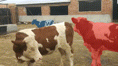</td>
        <td>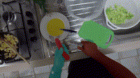</td>
      </tr>
    </tbody>
  </table>

  <table  align="center">
    <tbody>
      <tr>
        <th class="media1">Tracking-Any-Granularity</th>
        <th class="media1">GOT-10k</th>
        <th class="media1">NFS</th>
      </tr>
      <tr>
        <td>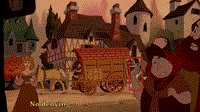</td>
        <td>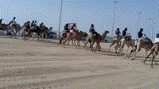</td>
        <td>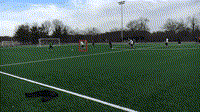</td>
      </tr>
    </tbody>
  </table>

  <table  align="center">
    <tbody>
      <tr>
        <th class="media1">Tracking-Any-Granularity</th>
        <th class="media1">TAPVid DAVIS</th>
        <th class="media1">RoboTAP</th>
      </tr>
      <tr>
        <td>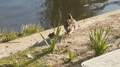</td>
        <td>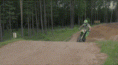</td>
        <td>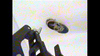</td>
      </tr>
    </tbody>
  </table>

## 📄 License

This project is licensed under the Apache License - see the [LICENSE](LICENSE) file for details.

## 👍 Contributing

See [contributing](CONTRIBUTING.md) and the [code of conduct](CODE_OF_CONDUCT.md).

## 📚 Citing SAM 2++

If you use SAM 2++ or the Tracking-Any-Granularity dataset in your research, please use the following BibTeX entry.

```bibtex
@article{zhang2025sam2trackinggranularity,
  title={SAM 2++: Tracking Anything at Any Granularity},
  author={Jiaming Zhang and Cheng Liang and Yichun Yang and Chenkai Zeng and Yutao Cui and Xinwen Zhang and Xin Zhou and Kai Ma and Gangshan Wu and Limin Wang},
  journal={arXiv preprint arXiv:2510.18822},
  url={https://arxiv.org/abs/2510.18822},
  year={2025}
}
```

## 🙏 Acknowledgments
We would like to thank [Segment Anything 2 (SAM 2)](https://github.com/facebookresearch/segment-anything) for their contributions to the field of computer vision and for providing the foundation upon which SAM 2++ is built.
